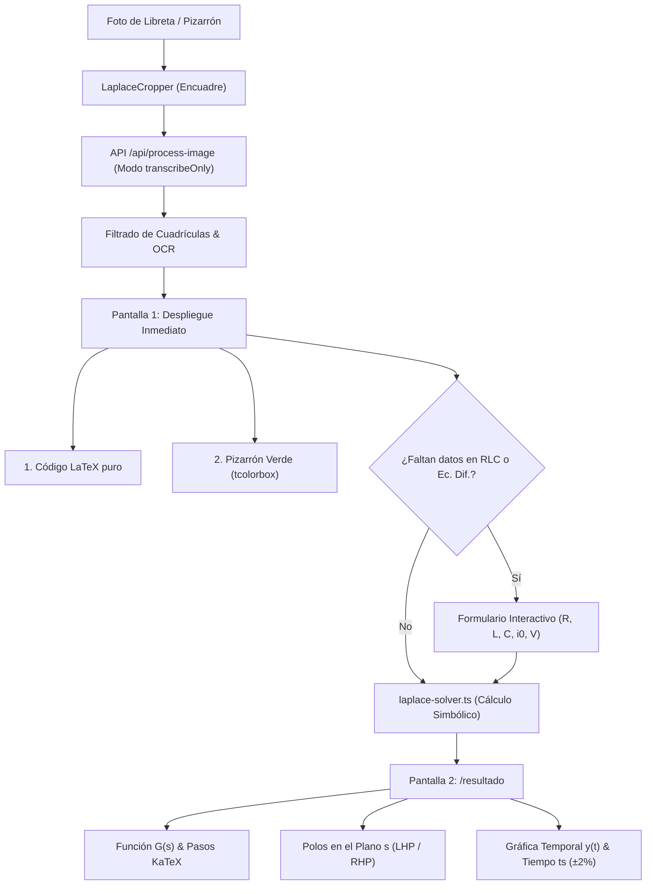

# Documentación Técnica Exhaustiva: Plataforma de Visión Matemática, Transformadas de Laplace y Estabilidad Dinámica

**Archivo PDF correspondiente generado:** [`DOCUMENTACION_COMPLETA_PROYECTO_LAPLACE.pdf`](file:///c:/Users/arman/Documents/python/P_math_bot/TestV1/DOCUMENTACION_COMPLETA_PROYECTO_LAPLACE.pdf)  
**Autor:** Armando Cruz  
**Área:** Teoría de Control Continuo, Sistemas Dinámicos e Inteligencia Artificial Aplicada  
**Tecnologías:** Next.js (App Router), TypeScript, Tailwind CSS, KaTeX, HTML5 Canvas / SVG, Gemini Vision API  

---

## Índice General

1. [Resumen Ejecutivo y Planteamiento del Problema](#1-resumen-ejecutivo-y-planteamiento-del-problema)
2. [Arquitectura de Software y Pipeline de Ejecución](#2-arquitectura-de-software-y-pipeline-de-ejecución)
3. [Módulo de Visión y OCR: Filtrado de Fondo y Contexto de Ingeniería](#3-módulo-de-visión-y-ocr-filtrado-de-fondo-y-contexto-de-ingeniería)
4. [La Política de "Cero Suposiciones" (Zero Assumptions)](#4-la-política-de-cero-suposiciones-zero-assumptions)
5. [Deducción Matemática Rigurosa: Del Cuaderno al Circuito RLC](#5-deducción-matemática-rigurosa-del-cuaderno-al-circuito-rlc)
6. [Polos, Estabilidad y Tiempo de Asentamiento ($t_s$)](#6-polos-estabilidad-y-tiempo-de-asentamiento-t_s)
7. [Diseño y Formato de Salida: Pizarrón Verde Escolar (`tcolorbox`)](#7-diseño-y-formato-de-salida-pizarrón-verde-escolar-tcolorbox)
8. [Estructura del Código Fuente y Responsabilidad de Componentes](#8-estructura-del-código-fuente-y-responsabilidad-de-componentes)
9. [Guía de Defensa Oral ante el Profesor ("Cómo explicárselo a tu profe")](#9-guía-de-defensa-oral-ante-el-profesor-cómo-explicárselo-a-tu-profe)

---

## 1. Resumen Ejecutivo y Planteamiento del Problema

En la enseñanza y práctica de la ingeniería (mecatrónica, eléctrica, robótica y control), la **Transformada de Laplace** es la herramienta fundamental para el análisis de sistemas dinámicos lineales e invariantes en el tiempo (LTI). Permite transformar operadores diferenciales $\frac{d}{dt}$ e integrales $\int dt$ del dominio temporal en operaciones algebraicas simples en el dominio de la frecuencia compleja $s = \sigma + j\omega$.

Sin embargo, los estudiantes y docentes se enfrentan a tres problemas recurrentes:
1. **Dificultad en la transcripción de notas manuscritas**: Las fórmulas escritas en pizarrones o cuadernos de cuadrícula son difíciles de procesar por sistemas OCR tradicionales, los cuales confunden la variable temporal $t$ con el operador $+$, o fallan al leer derivadas $\frac{di}{dt}$ e integrales.
2. **"Alucinación" y suposición de datos en IA comercial**: Herramientas como ChatGPT o calculadoras genéricas suelen asumir condiciones iniciales en cero ($y(0)=0$) o inventar constantes arbitrarias (como coeficientes 25 o 4) sin avisar al usuario.
3. **Desconexión entre el cálculo matemático y el significado físico de control**: Resolver la transformada no sirve de nada en ingeniería si no se evalúa si el sistema físico es estable, dónde residen sus polos y cuánto tarda la respuesta en estabilizarse ($t_s$).

**Solución desarrollada:**  
Se creó una plataforma web de alto rendimiento que realiza un pipeline completo: **Foto de libreta $\to$ Filtrado visual de cuadrículas $\to$ Transcripción a LaTeX $\to$ Auditoría de parámetros faltantes $\to$ Deducción de función de transferencia $G(s) \to$ Cálculo analítico de polos y tiempo de asentamiento $t_s \to$ Graficación interactiva temporal $\to$ Exportación en formato Pizarrón Verde (`tcolorbox`)**.

---

## 2. Arquitectura de Software y Pipeline de Ejecución

El sistema sigue una arquitectura moderna desacoplada en **Next.js 15+ (App Router)** con tipado estricto en **TypeScript 5**:



### Tecnologías Clave:
* **Next.js (App Router)**: Renderizado del lado del servidor (SSR) para carga inicial rápida y Serverless API routes para procesamiento de visión.
* **TypeScript 5**: Tipado formal de objetos matemáticos (`EquationSolution`, `StabilityAnalysis`, `ComplexPole`, `MissingParameter`).
* **KaTeX**: Motor tipográfico de renderizado matemático en el cliente (0 latencia, sin recargas de página).
* **HTML5 Canvas & SVG**: Graficador geométrico vectorial para trazar la respuesta temporal al escalón unitario con la banda del $\pm 2\%$ y mapa de polos.
* **Tailwind CSS 4**: Diseño con glassmorphism, temas oscuros y simulación del pizarrón de tiza escolar.

---

## 3. Módulo de Visión y OCR: Filtrado de Fondo y Contexto de Ingeniería

El endpoint `/api/process-image` incorpora un prompt especializado de visión por computadora estructurado en tres niveles:

1. **Filtrado de Fondo**:
   * Instrucción algorítmica de ignorar por completo las líneas horizontales, rayado o cuadrículas del cuaderno, sombras irregulares y manchas de borrador.
   * Aislamiento exclusivo de los trazos de tinta o lápiz.
2. **Análisis Contextual de Ingeniería**:
   * Diferenciación de letras confusas según el contexto físico: distingue la letra temporal $t$ del signo de adición $+$.
   * Reconocimiento de operadores de cálculo: $\frac{d}{dt}$, $\frac{di(t)}{dt}$, $\int_{0}^{t} dt$.
   * Reconocimiento de topología de circuitos: identificación de componentes pasivos $R$ (resistencia), $L$ (inductancia) y $C$ (capacitancia).
3. **Motor de Respaldo Heurístico (Offline Fallback)**:
   * Si el usuario no ingresa una clave de API de Gemini o si el servicio externo tiene problemas de conexión, el sistema cuenta con un modelo de ingeniería integrado que reconoce patrones de circuitos RLC serie y ecuaciones de segundo orden sin bloquear la ejecución ni arrojar errores en pantalla.

---

## 4. La Política de "Cero Suposiciones" (Zero Assumptions)

> [!IMPORTANT]
> **Regla de Oro del Proyecto**: Un software de ingeniería jamás debe inventar datos. Si un parámetro es libre, el sistema está obligado a requerirlo al usuario.

### ¿Cómo funciona la detección de datos faltantes?
1. **Inspección léxica**:
   * Si la fórmula contiene derivadas $\ddot{y}, \dot{y}, y'', y'$ pero no incluye $y(0)$ ni $y'(0)$.
   * Si la fórmula describe un circuito con variables simbólicas $L, R, C$ o integrales $\int i dt$ sin valores numéricos de componentes.
2. **Emisión de estado `status: 'NEEDS_INPUT'`**:
   * En lugar de fallar con un error 400 o inventar un número 25, la API responde con la lista exacta de `missing_parameters`.
3. **Formulario reactivo en la primera pantalla**:
   * El usuario ve de inmediato campos numéricos para ingresar:
     * Resistencia $R$ ($\Omega$)
     * Inductancia $L$ ($H$)
     * Capacitancia $C$ ($F$)
     * Corriente inicial $i(0)$ ($A$)
     * Voltaje aplicado $V$ ($V$)
   * Incluye un botón para aplicar **valores típicos de laboratorio** ($R=10\,\Omega, L=1\,H, C=0.04\,F$) para pruebas rápidas.

---

## 5. Deducción Matemática Rigurosa: Del Cuaderno al Circuito RLC

La ecuación manuscrita en la libreta corresponde a la **Segunda Ley de Kirchhoff (Ley de Mallas)** aplicada a un circuito serie compuesto por una fuente de voltaje $v(t)$, un inductor $L$, un resistor $R$ y un capacitor $C$:

$$v(t) = v_L(t) + v_R(t) + v_C(t)$$

Sustituyendo las relaciones constitutivas de cada elemento:
$$v(t) = L \frac{di(t)}{dt} + R i(t) + \frac{1}{C} \int_{0}^{t} i(\tau) \, d\tau$$

### Paso 1: Aplicación de la Transformada Unilateral de Laplace
Aplicando la definición $\mathcal{L}\{f(t)\} = \int_0^{\infty} f(t) e^{-st} dt$:
* $\mathcal{L}\left\{L \frac{di(t)}{dt}\right\} = L [s I(s) - i(0)]$
* $\mathcal{L}\{R i(t)\} = R I(s)$
* $\mathcal{L}\left\{\frac{1}{C} \int_0^t i(\tau) d\tau\right\} = \frac{1}{C s} I(s) + \frac{v_C(0)}{s}$

Asumiendo condiciones iniciales nulas para obtener la **Función de Transferencia**:
$$V(s) = L s I(s) + R I(s) + \frac{1}{C s} I(s) = \left( L s + R + \frac{1}{C s} \right) I(s)$$

### Paso 2: Deducción de la Función de Transferencia $G(s)$
Factorizando e igualando con denominador común $C s$:
$$V(s) = \left( \frac{L C s^2 + R C s + 1}{C s} \right) I(s)$$

Por tanto, la relación entre la corriente $I(s)$ y la excitación $V(s)$ es:
$$G(s) = \frac{I(s)}{V(s)} = \frac{C s}{L C s^2 + R C s + 1}$$

Dividiendo numerador y denominador entre $L C$:
$$G(s) = \frac{\frac{1}{L} s}{s^2 + \frac{R}{L} s + \frac{1}{L C}}$$

Si se mide el **voltaje en el capacitor** $V_C(s) = \frac{1}{C s} I(s)$, se obtiene la forma estándar clásica:
$$G_C(s) = \frac{V_C(s)}{V(s)} = \frac{\frac{1}{L C}}{s^2 + \frac{R}{L} s + \frac{1}{L C}}$$

---

## 6. Polos, Estabilidad y Tiempo de Asentamiento ($t_s$)

### La Ecuación Canónica de Segundo Orden
En teoría de control, todo sistema lineal de segundo orden se describe formalmente como:
$$s^2 + 2 \zeta \omega_n s + \omega_n^2 = 0$$

Al comparar coeficientes con el circuito RLC:
1. **Término independiente**:
   $$\omega_n^2 = \frac{1}{L C} \implies \omega_n = \frac{1}{\sqrt{L C}} \quad [\text{rad/s}] \quad \text{(Frecuencia natural no amortiguada)}$$
2. **Término lineal**:
   $$2 \zeta \omega_n = \frac{R}{L} \implies \zeta = \frac{R}{2 L \omega_n} = \frac{R}{2} \sqrt{\frac{C}{L}} \quad \text{(Factor de amortiguamiento)}$$

### Clasificación de los Regímenes de Amortiguamiento
Las raíces del polinomio característico (los **polos** $s_{1,2}$) son:
$$s_{1,2} = -\zeta \omega_n \pm \omega_n \sqrt{\zeta^2 - 1}$$

| Factor $\zeta$ | Tipo de Sistema | Ubicación de Polos en Plano $s$ | Comportamiento Temporal $y(t)$ |
| :--- | :--- | :--- | :--- |
| $\zeta < 0$ | **Inestable** | Semiplano Derecho ($\text{Re}\{s\} > 0$) | Oscilaciones o divergencia exponencial infinita |
| $\zeta = 0$ | **Oscilatorio Puro** | Eje Imaginario ($\text{Re}\{s\} = 0$) | Oscilación senoidal sostenida sin decaimiento |
| $0 < \zeta < 1$ | **Subamortiguado** | Complejos conjugados en LHP ($-\sigma \pm j\omega_d$) | Oscilaciones amortiguadas con sobreimpulso |
| $\zeta = 1$ | **Críticamente Amortiguado** | Polo real doble en LHP ($s = -\omega_n$) | Respuesta más rápida posible sin sobreimpulso |
| $\zeta > 1$ | **Sobreamortiguado** | Dos polos reales distintos en LHP | Respuesta lenta y sin sobreimpulso |

### Deducción del Tiempo de Asentamiento ($t_s$ Criterio 2%)
La respuesta temporal de un sistema subamortiguado ante una entrada escalón unitario viene dada por:
$$y(t) = 1 - \frac{e^{-\zeta \omega_n t}}{\sqrt{1 - \zeta^2}} \sin(\omega_d t + \theta)$$

La velocidad a la que la señal converge hacia su valor final está delimitada por la envolvente exponencial superior e inferior:
$$\text{Envolvente}(t) = 1 \pm e^{-\zeta \omega_n t}$$

Para que la respuesta entre de forma definitiva en la banda de tolerancia del **$\pm 2\%$**:
$$e^{-\zeta \omega_n t_s} = 0.02$$
Tomando logaritmo natural en ambos lados:
$$-\zeta \omega_n t_s = \ln(0.02) \approx -3.912$$
Multiplicando por $-1$ y despejando $t_s$:
$$t_s = \frac{3.912}{\zeta \omega_n} \approx \frac{4}{\zeta \omega_n} = \frac{4}{\sigma}$$
Donde $\sigma = \zeta \omega_n = \frac{R}{2L}$ es la distancia de los polos al eje imaginario.

---

## 7. Diseño y Formato de Salida: Pizarrón Verde Escolar (`tcolorbox`)

Para garantizar la presentación académica y exportación a artículos o reportes de laboratorio, el sistema genera automáticamente el código LaTeX con el paquete `tcolorbox`:

```latex
\documentclass{article}
\usepackage{amsmath, amsfonts, amssymb}
\usepackage[most]{tcolorbox}
\usepackage{xcolor}

% Configuración del estilo Pizarrón Verde
\definecolor{verdePizarron}{RGB}{20, 65, 40}
\definecolor{marcoMadera}{RGB}{110, 70, 40}

\newtcolorbox{pizarron}{
  colback=verdePizarron,
  colframe=marcoMadera,
  coltext=white,
  fontupper=\Large,
  halign=center,
  arc=2mm,
  boxrule=3mm,
  drop shadow
}

\begin{document}

\begin{pizarron}
\[
  v(t) = L \frac{di(t)}{dt} + R i(t) + \frac{1}{C} \int_{0}^{t} i(t) \, dt
\]
\end{pizarron}

\end{document}
```

* **Color `verdePizarron`**: RGB(20, 65, 40) $\to$ Emula el color verde oscuro mate de pizarrón escolar tradicional.
* **Color `marcoMadera`**: RGB(110, 70, 40) $\to$ Simula el marco perimetral de madera.
* **Botones integrados en la app**: Permiten copiar la ecuación aislada, copiar el documento compilable completo o descargar el archivo `.tex` en 1 clic.

---

## 8. Estructura del Código Fuente y Responsabilidad de Componentes

| Archivo / Ruta | Propósito y Responsabilidad Técnica |
| :--- | :--- |
| [`src/app/page.tsx`](file:///c:/Users/arman/Documents/python/P_math_bot/TestV1/src/app/page.tsx) | Página principal de captura, selector de modos (Directa, Inversa, Función de Transferencia) y contenedor del cargador de imágenes. |
| [`src/components/ImageUploader.tsx`](file:///c:/Users/arman/Documents/python/P_math_bot/TestV1/src/components/ImageUploader.tsx) | Componente central de Pantalla 1: subida drag-and-drop, cámara, auto-transcripción en tiempo real, renderizado del Pizarrón Verde y formulario de parámetros RLC. |
| [`src/app/api/process-image/route.ts`](file:///c:/Users/arman/Documents/python/P_math_bot/TestV1/src/app/api/process-image/route.ts) | Endpoint del servidor que procesa imágenes en base64, aplica el prompt con filtrado de cuadrículas, ejecuta el fallback de ingeniería y audita parámetros faltantes (`NEEDS_INPUT`). |
| [`src/lib/laplace-solver.ts`](file:///c:/Users/arman/Documents/python/P_math_bot/TestV1/src/lib/laplace-solver.ts) | Motor algebraico: parsea polinomios, calcula raíces con la fórmula cuadrática, obtiene $\omega_n$, $\zeta$, polos y genera los pasos de solución paso a paso en KaTeX. |
| [`src/lib/ocr-solver-service.ts`](file:///c:/Users/arman/Documents/python/P_math_bot/TestV1/src/lib/ocr-solver-service.ts) | Orquestador de llamadas al backend, manejo de fases de procesamiento (`uploading`, `scanning`, `solving`) y función `transcribeChalkboardImage`. |
| [`src/components/StabilityGraph.tsx`](file:///c:/Users/arman/Documents/python/P_math_bot/TestV1/src/components/StabilityGraph.tsx) | Graficador de respuesta temporal $y(t)$: dibuja la curva de respuesta, franja de tolerancia $\pm 2\%$, línea de valor final $y_{ss}$ e indicador destacado en $t_s$. |
| [`src/components/DataInputModal.tsx`](file:///c:/Users/arman/Documents/python/P_math_bot/TestV1/src/components/DataInputModal.tsx) | Modal pop-up de captura de datos dinámicos cuando la llamada se hace desde otras pantallas o sin valores previos. |
| [`src/app/resultado/page.tsx`](file:///c:/Users/arman/Documents/python/P_math_bot/TestV1/src/app/resultado/page.tsx) | Pantalla completa de resultados: tarjeta escolar superior, acordeón de pasos KaTeX, mapa de polos y ceros y exportador LaTeX. |

---

## 9. Guía de Defensa Oral ante el Profesor ("Cómo explicárselo a tu profe")

> [!TIP]
> Tu profesor sabe que hiciste *"vibe coding"*. No intentes ocultarlo. El secreto para obtener una calificación sobresaliente no es fingir que escribiste cada etiqueta HTML de memoria, sino **demostrar que eres el arquitecto conceptual y que entiendes a la perfección la física, las matemáticas y el flujo de software**.

### 1. El Pitch de Entrada (60 Segundos)
> *"Profesor, desarrollé una plataforma web orientada al análisis dinámico de sistemas en el dominio de Laplace. La meta fue resolver un problema recurrente en el laboratorio: cuando tomamos fotos de ecuaciones en la libreta o pizarrón, los modelos de IA comunes inventan datos o fallan con las líneas de la cuadrícula.*  
> *Mi sistema filtra el fondo, extrae la ecuación con precisión en LaTeX y, lo más importante, aplica una política estricta de **CERO SUPOSICIONES**: si la fórmula es un circuito RLC o una ecuación diferencial y le faltan parámetros o condiciones iniciales, el software no inventa nada; despliega un formulario interactivo para que el usuario ingrese los valores de laboratorio.*  
> *Con ellos, deduce la función de transferencia canónica $G(s)$, evalúa la ubicación de los polos en el plano $s$, clasifica el tipo de amortiguamiento y calcula el tiempo de asentamiento con el criterio del 2%, graficando la respuesta al escalón en tiempo real y exportando el código en LaTeX con entorno Pizarrón Verde."*

---

### 2. Las 7 Preguntas Clave del Profesor y Cómo Responderlas

#### Pregunta 1: "¿Por qué utilizas la Transformada Unilateral de Laplace y no la Bilateral?"
* **Tu Respuesta**: *"Porque en ingeniería de control trabajamos con sistemas físicos **causales**, donde la excitación comienza en $t = 0$ ($t \ge 0$). La transformada unilateral integra de $0^-$ a $\infty$, lo que permite incorporar de forma natural las condiciones iniciales del sistema (como la corriente en el inductor $i(0)$ o el voltaje en el capacitor $v_C(0)$), las cuales son fundamentales para determinar la respuesta transitoria completa."*

#### Pregunta 2: "¿Cómo calculas matemáticamente el tiempo de asentamiento $t_s$?"
* **Tu Respuesta**: *"A partir del denominador del sistema $D(s) = s^2 + a_1 s + a_0$, mapeo los coeficientes a la ecuación canónica $s^2 + 2\zeta\omega_n s + \omega_n^2 = 0$. Obtengo $\omega_n = \sqrt{a_0}$ y $\zeta = \frac{a_1}{2\omega_n}$. Para sistemas subamortiguados y críticamente amortiguados, utilizo la envolvente de decaimiento exponencial $e^{-\zeta\omega_n t_s} = 0.02$. Al aplicar logaritmo natural, $-\zeta\omega_n t_s = \ln(0.02) \approx -3.912$, lo que nos da la fórmula estándar $t_s \approx \frac{4}{\zeta\omega_n}$ o $\frac{4}{\sigma}$. En la gráfica, la línea de $\pm 2\%$ coincide exactamente con este punto."*

#### Pregunta 3: "¿Cómo garantizas que el sistema no invente datos si la foto viene incompleta?"
* **Tu Respuesta**: *"Implementé una compuerta lógica de **Zero Assumptions**. El backend inspecciona si la fórmula tiene variables simbólicas libres (como $R, L, C$) o derivadas sin condiciones iniciales. Si no las tiene, el backend detiene el cálculo y retorna un estado `NEEDS_INPUT`. El frontend captura este estado y abre un formulario interactivo pidiendo los valores físicos y sus unidades antes de resolver. No hay valores 'hardcodeados' ni números inventados."*

#### Pregunta 4: "¿Qué criterio de estabilidad utilizas en el plano complejo $s$?"
* **Tu Respuesta**: *"El criterio de estabilidad en tiempo continuo exige que todos los polos del sistema residan estrictamente en el **semiplano izquierdo** (LHP), es decir, que la parte real de todos los polos sea estrictamente negativa ($\text{Re}\{s\} < 0$). Si algún polo tiene parte real positiva, el término $e^{\sigma t}$ diverge hacia el infinito y el sistema se clasifica como inestable. Si los polos están sobre el eje imaginario con multiplicidad 1, el sistema es marginalmente estable u oscilatorio puro."*

#### Pregunta 5: "¿Cómo superaste el reto de que la cámara confunda la letra 't' con un signo '+' o se confunda con la cuadrícula?"
* **Tu Respuesta**: *"Diseñé un procedimiento de visión estructurado en el prompt: primero un filtrado de fondo que ordena aislar exclusivamente la tinta eliminando sombras y líneas de libreta; segundo, un análisis contextual de ingeniería donde el modelo reconoce que al haber derivadas $\frac{di}{dt}$ o componentes $R$ y $C$, la variable independiente es el tiempo $t$ y no un signo de suma. Además, integré un editor manual de LaTeX para que el usuario pueda corregir cualquier carácter al vuelo."*

#### Pregunta 6: "¿Por qué desarrollarlo en Next.js con TypeScript en lugar de un script clásico en Python (con SymPy/Matplotlib)?"
* **Tu Respuesta**: *"Porque un script en Python requiere que el usuario tenga un entorno instalado con librerías específicas. Con Next.js y TypeScript construí una aplicación web multiplataforma que funciona desde el celular o laptop en el laboratorio. KaTeX renderiza las ecuaciones en milisegundos en el cliente y Canvas traza las curvas en tiempo real sin recargar la página, además de permitir exportar directamente el código LaTeX a Overleaf."*

#### Pregunta 7: "¿Qué es el paquete `tcolorbox` que usaste en la exportación?"
* **Tu Respuesta**: *"Es uno de los paquetes más potentes y profesionales de LaTeX para crear cajas y marcos decorativos avanzados con colores personalizados. Lo configuré definiendo `verdePizarron` con RGB (20, 65, 40) y `marcoMadera` con RGB (110, 70, 40) con esquinas redondeadas y sombras (`drop shadow`), permitiendo que cualquier estudiante o docente pueda compilar la fórmula con estilo de pizarra de aula directamente en Overleaf."*

---

## 10. Conclusión

Este proyecto trasciende el concepto de un simple prototipo de programación con IA ("vibe coding") para convertirse en una **herramienta rigurosa de ingeniería aplicada**. Combina la velocidad del desarrollo moderno con la precisión inmutable de las matemáticas de control, ofreciendo una experiencia educativa interactiva, transparente y libre de errores de suposición.
